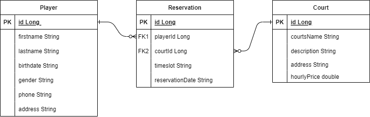

# Badminton courts reservation android application
**Authors:** François Brouchoud and Luca Del Buono

This application was developed as part of the mobile development course (644-1) project at the University of Applied Sciences HES-SO Valais-Wallis. 
It consists of the management of badminton court reservations. The app is available on the Google Play.

## Courts
We can add new courts by clicking on the plus (floating action button). We can edit them by long-clicking on the court line. On the edit page, we can delete the court by clicking on the trash icon.

## Players
We can create new players by clicking on the plus (floating action button). To insert a player's birthdate, a date picker dialog is shown to the user. By long-clicking on a player's line, we can delete the player. The simple click will allow the user to edit the player.

## Reservations
To reserve a court, we need to simple click on a court line. To insert a reservation's date, a date picker dialog is shown to the user. We can also delete the reservation by long-clicking on the line from the reservation page. A simple click will display the edit reservation page.

#### Reservation check
When we create a new reservation, the following checks will be done:
1. Check if the date and time are not empty
2. Check if the date and time are not in the past
3. Check if there's not already a reservation for the same court at the same time and date

## Settings
The settings are accessible with the three dots on the toolbar.

### Dark mode
It is possible to switch between light and dark mode. This mode will be saved when the user quits the app and will be reloaded on app reopening.

### About
The about page displays some info about the app. Furthermore, it's possible to write feedback and send it to the developers by email. The HES-SO logo will automatically refresh depending on the theme (dark or light).

## Database
The database is implemented locally on the phone with Room API.

Here is the database diagram:

